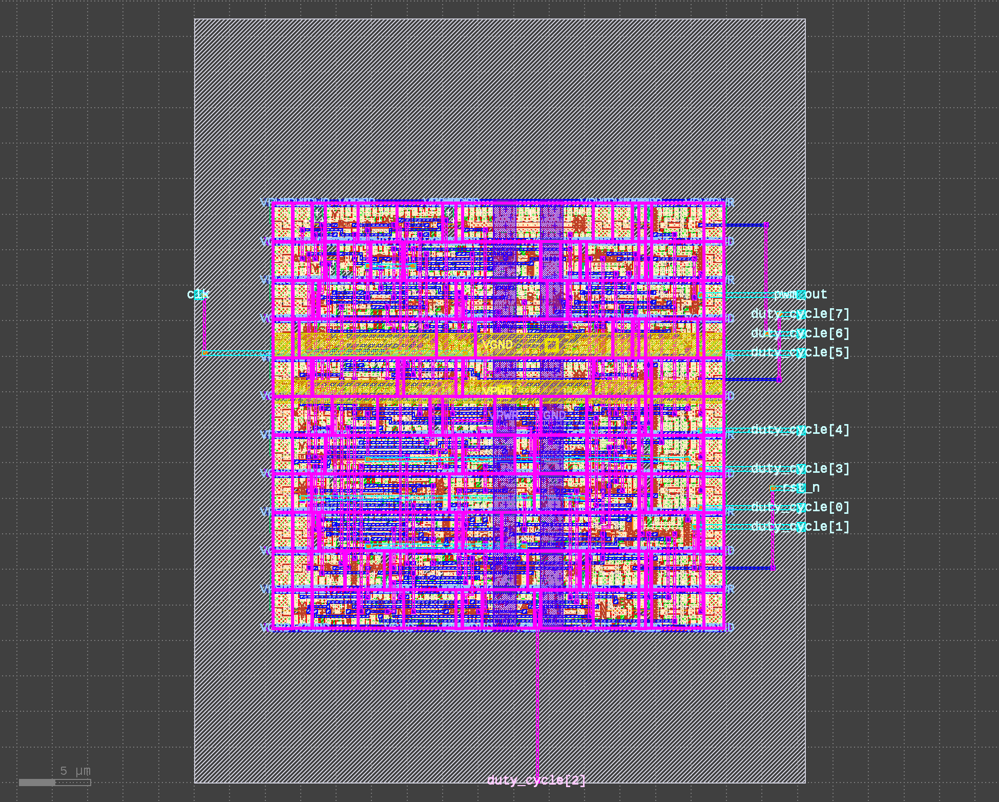

# PWM Generator — RTL-to-GDS

A digital **pulse-width-modulation (PWM) generator** written in Verilog and
built with an industry-style **RTL-to-GDS** flow. The design is verified with a
[cocotb](https://www.cocotb.org/) testbench and taken all the way to a
manufacturable layout on the open-source SkyWater **Sky130A** process, where it
closes timing, DRC, and LVS.




---

## 1. What It Does

A PWM generator produces a square wave that repeats at a fixed frequency. In
each period the signal is high for some fraction of the time (the **duty
cycle**) and low for the rest. By changing the duty cycle you control how much
average power or brightness is delivered — useful for motor speed control, LED
dimming, switching power supplies, and audio.

This implementation is digital: an 8-bit counter free-runs from `0` to `255`
once per period, and the output is the result of a single comparison.

- `pwm_out` is **high** while `counter < duty_cycle`.
- `pwm_out` is **low** while `counter ≥ duty_cycle`.
- The counter wraps every **256** clock cycles.

### Design specification

| Signal | Direction | Width | Purpose |
| --- | --- | --- | --- |
| `clk` | Input | 1 | Clock. The output period is 256 `clk` cycles. |
| `rst_n` | Input | 1 | Active-low reset (asynchronous). Clears the counter and forces `pwm_out` low. |
| `duty_cycle` | Input | 8 | Target duty value, `0`–`255`. |
| `pwm_out` | Output | 1 | PWM output. |

### Key parameters

- **Duty-cycle resolution:** 256 steps → `duty = duty_cycle / 256` (0 %–99.6 %).
- **Output frequency:** `f_pwm = f_clk / 256`. With the 100 MHz clock used by
  the implementation flow, the output runs at **≈ 390.6 kHz**.
- `duty_cycle = 0` holds the output continuously low (a true 100 % high is not
  reachable with this scheme; 255/256 ≈ 99.6 % is the maximum).

### RTL

```verilog
module pwm_gen (
    input  wire       clk,
    input  wire       rst_n,
    input  wire [7:0] duty_cycle,
    output reg        pwm_out
);
    reg [7:0] counter;

    always @(posedge clk or negedge rst_n) begin
        if (!rst_n) begin
            counter <= 8'd0;
            pwm_out <= 1'b0;
        end else begin
            counter <= counter + 8'd1;
            pwm_out <= (counter < duty_cycle);
        end
    end
endmodule
```

---

## 2. Repository Contents

| Path | Description |
| --- | --- |
| `pwm_gen.v` | Synthesizable PWM generator RTL. |
| `test_pwm_gen.py` | cocotb testbench (duty-cycle and zero-duty tests). |
| `Makefile` | Simulation entry point (cocotb + Icarus Verilog). |
| `config.json` | Physical-design (RTL-to-GDS) configuration. |
| `pwm_gen.png` | Rendered view of the final chip layout. |
| `README.md` | This file. |

---

## 3. Functional Verification (cocotb)

The testbench drives the DUT with a 10 ns clock and checks the output by
counting high cycles over a complete 256-cycle period.

| Test | Check | Result |
| --- | --- | --- |
| `test_pwm_duty_cycle` | `duty_cycle = 64` → 25 % high (±1 %) | **PASS** |
| `test_pwm_zero_duty` | `duty_cycle = 0` → output stays low | **PASS** |

Both tests pass: the measured duty cycle for a target of 64/256 = 0.25 matches
within the 1 % tolerance, and the zero-duty boundary case produces a constant
low output. The simulation ends with no failures or errors.

---

## 4. RTL-to-GDS Implementation

The design was implemented with **LibreLane 3.0.15**, the OpenLane-family
RTL-to-GDS flow, targeting:

- **PDK:** SkyWater `sky130A`
- **Standard-cell library:** `sky130_fd_sc_hd`
- **Target clock period:** 10 ns (100 MHz)
- **Signoff corners:** 9 (typ/ss/ff × nom/min/max)
- **GDS stream-out:** Magic, cross-checked against KLayout

The flow ran to completion with **0 errors**.

### 4.1 Final metrics

| Metric | Value |
| --- | --- |
| Target clock | 10 ns (100 MHz) |
| Worst setup slack | **+4.95 ns** (corner `ss_100C_1v60`) |
| Estimated maximum clock | **≈ 198 MHz** (from the 5.05 ns register-to-register critical path; ignores I/O constraints) |
| Worst hold slack | **+0.108 ns** |
| Total power | **135.49 µW** |
| Core area | **949.66 µm²** |
| Die area | 2312.86 µm² |
| Die size | 43.03 µm × 53.75 µm |
| Core utilization | 84.3 % |
| Standard cells | 79 |
| Routed wirelength | 1300 µm |

Power breaks down as 111.94 µW internal, 23.56 µW switching, and 1.067 nW
leakage at the nominal corner (`tt_025C_1v80`, 1.8 V).

At synthesis the netlist maps to 43 cells (511.74 µm²), of which the 9
flip-flops make up 236.48 µm² (46.2 %). Place-and-route adds clock and repair
buffers, growing the placed cell area to 800.77 µm².

### 4.2 Timing

Timing is clean across **all 9 signoff corners** — 0 setup violations,
0 hold violations, and 0 max-slew / max-cap / max-fanout violations. The
+4.95 ns worst-case setup margin (against the 10 ns target) leaves substantial
headroom.

### 4.3 Power integrity and routing

| Metric | Value |
| --- | --- |
| Detail-route DRC errors | 0 |
| Power-grid violations | 0 |
| Worst IR drop | 58.5 µV (VPWR) |
| Average IR drop | 27.6 µV |
| Vias | 399 (all single-cut) |

### 4.4 Physical verification (signoff)

| Check | Result |
| --- | --- |
| Magic DRC | 0 errors ✅ |
| KLayout DRC | 0 errors ✅ |
| LVS (netgen) | 0 errors, 0 device/net/pin mismatches ✅ |
| GDS XOR (Magic vs. KLayout) | 0 differences ✅ |
| Antenna violations | 0 nets / 0 pins ✅ |
| Disconnected pins | 0 |

The flow's manufacturability report concludes **Antenna: Passed**,
**LVS: Passed**, and **DRC: Passed**.

---

## 5. How to Reproduce

### Functional simulation (cocotb + Icarus Verilog)

Install the tools, then run `make`:

```sh
brew install icarus-verilog
pip install cocotb
make        # SIM defaults to icarus
```

The testbench prints **PASS** for each test. (Simulation build artifacts and the
JUnit report are generated locally and are not committed.)

### Physical implementation

Ensure the Sky130A PDK is installed, then run the flow with the bundled
configuration:

```sh
librelane config.json
```

The flow writes its reports, netlist, and final GDS to a locally generated run
directory. These outputs are large and machine-specific, so they are not
committed to this repository.

---

## 6. Summary

| Aspect | Result |
| --- | --- |
| Function | 8-bit PWM, 256-step duty resolution, `f_out = f_clk / 256` |
| RTL lint | 0 errors, 0 warnings, 0 inferred latches |
| Functional tests | 2 / 2 passing |
| Process / library | Sky130A, `sky130_fd_sc_hd` |
| Timing | 9/9 corners clean; worst setup slack +4.95 ns @ 100 MHz |
| Power | 135.49 µW total (nominal) |
| Area | 949.66 µm² core, 84.3 % utilization |
| DRC / LVS / Antenna | All clean ✅ |

### Tools used

Icarus Verilog · cocotb · LibreLane (OpenLane family) · Sky130 PDK ·
Magic · KLayout · OpenROAD · netgen
